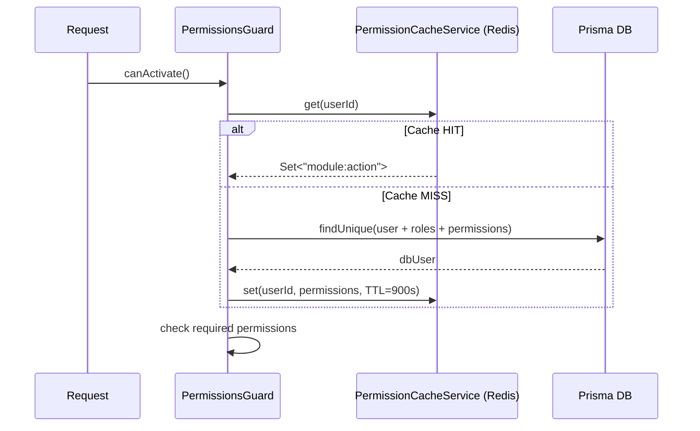
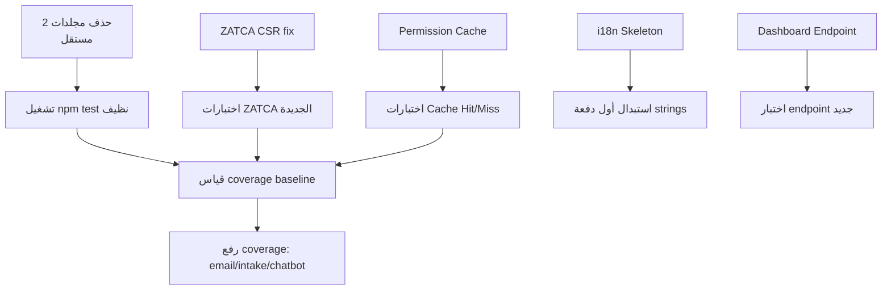

## الهدف العام
إصلاح 5 مشاكل موثقة في الباك اند بترتيب تصاعدي حسب الأثر على الإنتاج، مع الحفاظ على استقرار المنظومة الحالية.

---

## المرحلة الأولى — P0: إصلاحات حرجة تمنع الإنتاج

### الإصلاح 1 — ZATCA CSR الحقيقي

**المشكلة:**
`buildCsrBase64()` في `backend/src/modules/zatca/services/zatca-crypto.service.ts` (السطور 112–136) تنتج JSON مُشفر بـ Base64 بدلاً من DER-encoded X.509 CSR حقيقي. ZATCA API ستُعيد خطأ عند الإنتاج الفعلي.

**الخطوات:**

1. **تثبيت المكتبة**
   ```
   npm install @peculiar/x509 @peculiar/webcrypto
   ```
   - `@peculiar/x509`: تُنتج X.509 CSR متوافقة مع ASN.1 DER
   - `@peculiar/webcrypto`: تُوفر WebCrypto API في Node.js (مطلوبة من `@peculiar/x509`)

2. **تعديل `zatca-crypto.service.ts`**
   - استبدال الدالة `buildCsrBase64()` بالكامل
   - استخدام `Pkcs10CertificateRequestGenerator` من `@peculiar/x509`
   - الحفاظ على باقي الدوال كما هي (`generateKeyPair`, `encryptPrivateKey`, `decryptPrivateKey`)
   - **نقطة انتباه:** `generateKeyPair()` الحالية تنتج PEM — `@peculiar/x509` تعمل مع CryptoKey objects. الحل: `crypto.createPrivateKey(pem)` ثم `KeyObject.export({ format: 'jwk' })` لتحويله.
   - إضافة ZATCA-specific OIDs كـ subject attributes:
     - `SN` = serialNumber بصيغة `1-CareKit|2-15|3-{timestamp}`
     - `UID` = VAT number
     - `title` = business category

3. **ملف الاختبار:** `test/unit/zatca/zatca-crypto.service.spec.ts`
   - اختبار أن الناتج هو Base64 صالح يحتوي على بنية CSR (يبدأ بـ `MIIB` عادةً)
   - التحقق من وجود subject fields الصحيحة

**الملفات المتأثرة:**
- `backend/src/modules/zatca/services/zatca-crypto.service.ts` — تعديل `buildCsrBase64()`
- `backend/package.json` — إضافة dependency
- `backend/test/unit/zatca/zatca-crypto.service.spec.ts` — تحديث الاختبارات

---

### الإصلاح 2 — Permission Cache في Redis

**المشكلة:**
`permissions.guard.ts` (السطور 44–58) يُشغل Prisma query معقدة (3 مستويات include) على **كل** طلب محمي. الـ `AuthCacheService` موجود ويخزن `UserPayload` لكنه لا يشمل الـ permissions.

**التصميم المقترح:**



**الخطوات:**

1. **إنشاء `PermissionCacheService`**
   - ملف جديد: `backend/src/modules/auth/permission-cache.service.ts`
   - مفتاح Redis: `perm:user:{userId}` بـ TTL 900 ثانية (يطابق access token)
   - القيمة: مصفوفة strings مُسلسلة كـ JSON (مثال: `["bookings:view","payments:edit"]`)
   - دالة `get(userId): Promise<Set<string> | null>`
   - دالة `set(userId, permissions: Set<string>): Promise<void>`
   - دالة `invalidate(userId): Promise<void>`

2. **تعديل `permissions.guard.ts`**
   - حقن `PermissionCacheService`
   - محاولة Cache أولاً قبل Prisma query
   - تخزين النتيجة في Cache بعد DB query

3. **ربط الـ Invalidation**
   في `AuthService` و`UserRolesService` عند:
   - تغيير كلمة المرور → `permissionCacheService.invalidate(userId)`
   - تعطيل المستخدم → `permissionCacheService.invalidate(userId)`
   - تغيير الدور → `permissionCacheService.invalidate(userId)`

4. **تسجيل الـ Service في `AuthModule`**

**الملفات المتأثرة:**
- `backend/src/modules/auth/permission-cache.service.ts` — جديد
- `backend/src/modules/auth/guards/permissions.guard.ts` — تعديل
- `backend/src/modules/auth/auth.module.ts` — تسجيل الـ provider
- `backend/src/modules/auth/auth.service.ts` — invalidation عند password change
- `backend/src/modules/users/user-roles.service.ts` — invalidation عند role change
- `backend/test/unit/auth/permissions.guard.spec.ts` — اختبارات Cache Hit/Miss

---

## المرحلة الثانية — P1: جودة وإكمال ميزات ناقصة

### الإصلاح 3 — i18n Skeleton

**المشكلة:**
`nestjs-i18n` مثبتة لكن `src/i18n/` فارغة، وجميع النصوص hardcoded في الكود.

**نهج التنفيذ — Skeleton أولاً (لا نترجم كل شيء دفعة واحدة):**

1. **إنشاء بنية المجلدات:**
   ```
   backend/src/i18n/
   ├── ar/
   │   ├── auth.json
   │   ├── bookings.json
   │   ├── payments.json
   │   ├── common.json
   │   └── errors.json
   └── en/
       ├── auth.json
       ├── bookings.json
       ├── payments.json
       ├── common.json
       └── errors.json
   ```

2. **توصيل `I18nModule` في `AppModule`**
   - استخدام `I18nJsonLoader` مع `path: join(__dirname, '../i18n')`
   - إضافة `AcceptLanguageResolver` لقراءة header `Accept-Language`
   - تحديد `fallbackLanguage: 'ar'`

3. **البدء بالملفات الأكثر ظهوراً للمستخدم:**
   - `auth.json`: رسائل OTP، خطأ كلمة المرور، حساب غير نشط
   - `errors.json`: رسائل الـ HTTP errors الشائعة (403، 404، 422)
   - `common.json`: success messages

4. **استبدال أول دفعة hardcoded strings في:**
   - `auth.service.ts` — رسائل الـ OTP والتحقق
   - `permissions.guard.ts` — رسائل الـ Forbidden

5. **لا يُطلب استبدال كل النصوص** — الـ Skeleton + توصيل المكتبة + أول دفعة ترجمات كافٍ للمرحلة الأولى.

**الملفات المتأثرة:**
- `backend/src/app.module.ts` — تسجيل I18nModule
- `backend/src/i18n/ar/*.json` — 5 ملفات جديدة
- `backend/src/i18n/en/*.json` — 5 ملفات جديدة
- `backend/src/modules/auth/auth.service.ts` — استخدام I18nService (أول نموذج)
- `backend/src/modules/auth/guards/permissions.guard.ts` — استخدام I18nService

---

### الإصلاح 4 — Dashboard Stats Endpoint

**المشكلة:**
`DashboardStatsService` مكتملة بالكامل (128 سطر) مع caching (5 دقائق) لكن `ReportsController` لا يعرضها.

**الخطوات:**

1. **إضافة endpoint في `reports.controller.ts`:**
   ```
   GET /reports/dashboard?branchId=
   ```
   - Permission: `{ module: 'reports', action: 'view' }`
   - Optional query param: `branchId` (UUID)
   - الاستجابة: `DashboardStats` interface الموجودة

2. **حقن `DashboardStatsService`** في `ReportsController`

3. **تسجيل الـ Service في `ReportsModule`** (تأكد أنها مسجلة في providers)

4. **اختبار:** إضافة test case في `test/unit/reports/`

**الملفات المتأثرة:**
- `backend/src/modules/reports/reports.controller.ts` — إضافة endpoint
- `backend/src/modules/reports/reports.module.ts` — تأكيد تسجيل DashboardStatsService
- `backend/test/unit/reports/dashboard-stats.service.spec.ts` — اختبار جديد

---

### الإصلاح 5 — حذف مجلدات الاختبار المكررة

**المشكلة:**
29 مجلداً بصيغة `[module] 2` تحت `backend/test/unit/` — CI يُشغل كل اختبار مرتين.

**الخطوات:**
```bash
# حذف كل المجلدات المنتهية بـ " 2"
find backend/test/unit -maxdepth 1 -type d -name "* 2" -exec rm -rf {} +
```

**المجلدات التي ستُحذف (29 مجلداً):**
`activity-log 2`, `ai 2`, `auth 2`, `bookings 2`, `branches 2`, `chatbot 2`, `clinic 2`, `common 2`, `coupons 2`, `email 2`, `email-templates 2`, `gift-cards 2`, `intake-forms 2`, `invoices 2`, `notifications 2`, `patients 2`, `payments 2`, `permissions 2`, `practitioners 2`, `problem-reports 2`, `ratings 2`, `reports 2`, `roles 2`, `services 2`, `specialties 2`, `tasks 2`, `users 2`, `whitelabel 2`, `zatca 2`

**التحقق:** تشغيل `npm run test` والتأكد من انخفاض وقت التنفيذ بمقدار ~50%.

---

## المرحلة الثالثة — P2: رفع Test Coverage

**الهدف: الوصول من 50.6% إلى 65%+ statements**

### أولوية الوحدات حسب الخطورة والفجوة:

| الوحدة | الحالي | الهدف | الأولوية |
|--------|--------|-------|----------|
| `email` | 16% | 65% | 1 — حرج، يؤثر على كل notifications |
| `zatca` | 35% | 70% | 2 — P0 fix يحتاج اختبارات |
| `intake-forms` | 28% | 60% | 3 — يستخدم في pre-booking |
| `chatbot` | 41% | 65% | 4 — RAG + streaming معقد |

---

### تفصيل اختبارات كل وحدة:

#### Email Module (16% → 65%)
الملف المستهدف: `backend/test/unit/email/`

اختبارات مطلوبة:
- `EmailProcessor` — verify queue job dispatching لـ `sendWelcome`, `sendOtp`, `sendBookingConfirmation`
- `EmailService` — template variable substitution, fallback عند missing template
- Mock: `MailerService` + `PrismaService`

#### ZATCA Module (35% → 70%)
الملفات المستهدفة: `backend/test/unit/zatca/`

اختبارات مطلوبة:
- `ZatcaCryptoService` — generateKeyPair (صالح secp256k1), **generateCsr الجديد** (CSR Base64 صالح), encrypt/decrypt round-trip
- `InvoiceHashService` — SHA256 consistency, toBase64 encoding
- `QrGeneratorService` — TLV encoding صحيح لـ ZATCA format
- `XmlBuilderService` — validateعناصر UBL 2.1 الأساسية في الناتج
- Mock: `PrismaService`, `ConfigService`

#### Intake Forms Module (28% → 60%)
الملفات المستهدفة: `backend/test/unit/intake-forms/`

اختبارات مطلوبة:
- `IntakeFormsService` — CRUD كامل، scope filtering (global/service/practitioner/branch)
- `IntakeFormsService` — conditional field logic (الـ `condition` JSON field)
- Response submission — تخزين `answers` JSON
- Mock: `PrismaService`

#### Chatbot Module (41% → 65%)
الملفات المستهدفة: `backend/test/unit/chatbot/`

اختبارات مطلوبة:
- `ChatbotRagService` — embedding search mock (verify cosine similarity call)
- `ChatbotContextService` — context assembly من RAG results
- `ChatbotSessionService` — session create/resume/handoff
- `ChatbotConfigService` — EAV config read/write
- **لا تختبر streaming** في unit tests — اتركها لـ e2e
- Mock: `PrismaService`, `OpenRouterService`, `AiServiceModule`

---

## خريطة التبعيات بين الإصلاحات



---

## Delivery Checklist (لكل إصلاح)

| الإصلاح | الاختبار | no `any` | حجم الملف ≤350 | migration؟ |
|---------|----------|----------|----------------|------------|
| ZATCA CSR | unit spec جديد | مطلوب | تحقق | لا |
| Permission Cache | unit spec (hit/miss/invalidate) | مطلوب | `permission-cache.service.ts` سيكون ~60 سطر | لا |
| i18n Skeleton | تشغيل التطبيق + manual test | مطلوب | لا يوجد ملف TS ≥350 | لا |
| Dashboard Endpoint | unit + manual curl | مطلوب | تحقق من reports.controller.ts (حالياً 160 سطر، ستبقى ≤200) | لا |
| حذف مجلدات 2 | `npm run test` passes | — | — | لا |
| رفع Coverage | تشغيل `npm run test:cov` | مطلوب | تحقق من ملفات الاختبار | لا |

---

## ترتيب التنفيذ المقترح (تسلسلي)

```
1. حذف مجلدات " 2"          ← 10 دقائق، مستقل، يُنظف البيئة فوراً
2. ZATCA CSR fix              ← backend-dev + qa-engineer
3. Permission Cache            ← backend-dev + qa-engineer
4. Dashboard Endpoint         ← backend-dev (30 دقيقة)
5. i18n Skeleton              ← backend-dev
6. رفع Coverage               ← qa-engineer
```

> **ملاحظة:** لا توجد migrations مطلوبة في أي من هذه الإصلاحات — جميعها تعديلات على الكود فقط.
