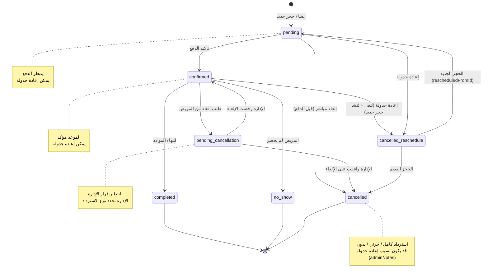
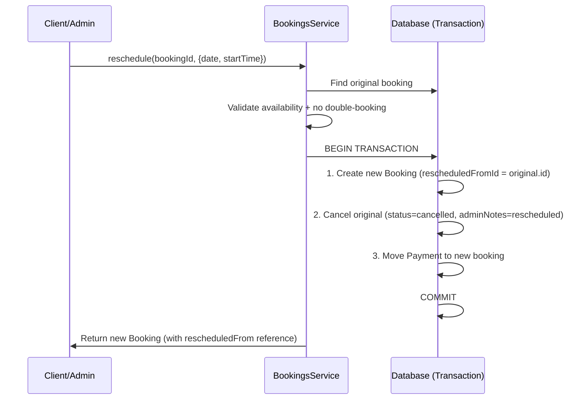
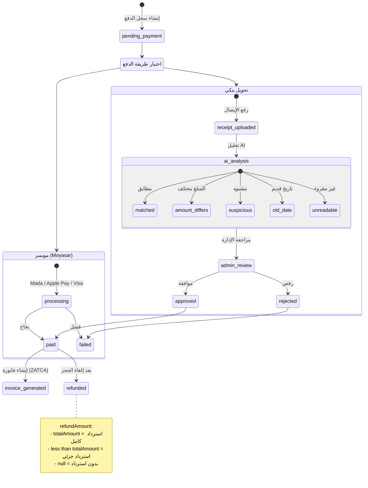

# Booking System — State & Flow Diagrams

> مخططات تدفق الحجز والإلغاء وإعادة الجدولة والدفع.
> للمخطط الهيكلي: [booking-erd.md](booking-erd.md) | للقيود: [booking-constraints.md](booking-constraints.md)

---

## تدفق دورة حياة الحجز (Booking Lifecycle)

---

## تدفق إعادة الجدولة (Reschedule Flow)

---

## تدفق الدفع (Payment Flow)

